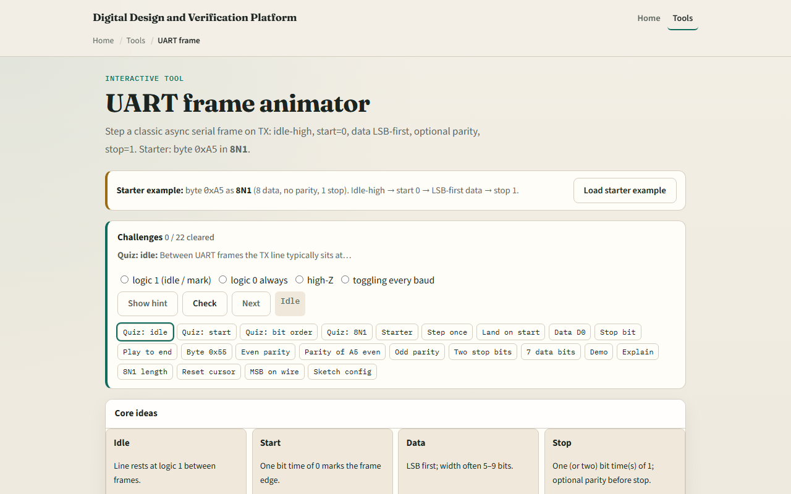

# Module 01 — UART frame

**Module id:** module01-uart-frame  
**Lab:** uart-frame  
**Tracks:** A (real RTL/TB) · B (browser lab)

## Slide 1 — UART frame

Asynchronous serial UART sends one byte as a timed bit sequence—no shared clock wire on the link. The line idles high at logic one. A start bit drops to zero for one bit time. Data follows LSB first, often five through nine bits. Optional parity may sit before stop. One or two stop bits return the line to one. Baud rate sets how long each bit lasts on the wire.

## Slide 2 — Starter 0xA5 as 8N1

Starter: byte hex A5 as eight-N-one—eight data bits, no parity, one stop bit. Idle high, start zero, then D0 through D7 LSB first, then stop one, then idle again. For A5 the LSB is one—binary one-zero-one-zero-zero-one-zero-one—so D0 and D7 are both one. Step bit by bit or play to end to watch the cursor move through twelve slots. Rebuild after changing width, parity, or stop count.

## Slide 3 — Browser lab

In the browser lab, load the starter example and watch the wave table and SVG trace. The verdict panel names the current slot—start, data, stop, or idle. Try Demo for a full A5 eight-N-one walkthrough, or switch to even parity and rebuild to see a parity bit inserted. Challenges ask you to land on start, D0, stop, and to read eight-N-one length.

## Slide 4 — Real RTL/TB practice

In Track A, sketch the same frame on paper: label idle, start, eight data bits LSB first, stop. Write what eight-N-one means in words. Optional: peek at UART examples in this module’s examples and name one signal you would drive in a TX state machine. This lab is frame literacy—not a full synthesizable UART yet.

## Slide 5 — Pitfalls to watch

Do not send MSB first on the wire—UART data is LSB first unless a non-standard profile says otherwise. Do not confuse baud with the system clock—they relate through a divider you will see next module. Parity changes the slot count; eight-E-one is not eight-N-one. And remember: this animator is conceptual timing; real RTL still needs sampling, metastability, and error handling in later modules.

## Slide 6 — Your turn

Complete the checklist for at least one track—preferably both. In the browser, step through starter A5 eight-N-one and land on start, D0, and stop. On paper, draw one complete frame with bit values labeled. When you are ready, take the short quiz, then continue to spec-to-RTL checklist.
