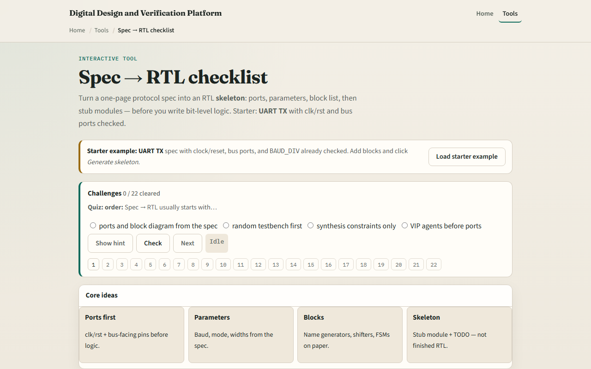

# Module 02 — Spec → RTL checklist

**Module id:** module02-spec-to-rtl  
**Lab:** spec-to-rtl  
**Tracks:** A (real RTL/TB) · B (browser lab)

## Slide 1 — Spec to RTL

Before you write bit-level logic, translate the spec into structure. List clock and reset ports, then bus-facing pins. Capture parameters—baud divider, mode bits, address width. Name the blocks: baud generator, shifter, byte FSM. Only then stub a module skeleton with TODO comments. This lab is that checklist—not finished synthesizable RTL.

## Slide 2 — UART TX starter

Starter preset: UART transmit eight-N-one. Three items already checked—clock and reset ports, host and line ports with tx valid, tx data, tx, and tx busy, plus baud parameter BAUD_DIV. Required blocks still waiting: baud generator, shift serializer, and byte FSM for idle, start, data, stop. Check the block rows, then click Generate skeleton to grow a uart_tx module outline.

## Slide 3 — Browser lab

In the browser lab, load the starter example and read the spec bullets on the left. Each checklist row adds a snippet to the skeleton panel on the right. Try Check required to see all mandatory UART items, or switch the preset to SPI mode zero or I²C byte write. Demo UART skeleton walks a complete minimal outline. Challenges ask for three starter checks and a generated module header.

## Slide 4 — Real RTL/TB practice

In Track A, from the UART TX spec list every port name and one parameter. Name three blocks you would draw on paper before coding. Optional: compare your list to a UART sketch in this module’s examples. Write one sentence on what belongs in the skeleton versus what belongs in the FSM implementation.

## Slide 5 — Pitfalls to watch

Do not skip ports and jump straight to the FSM—reviewers catch missing busy or valid first. Parameters are not optional when baud or mode defines behavior. A skeleton with TODO is not done RTL—this lab separates planning from implementation. And remember: the SPI and I²C presets use the same workflow; UART is just the course default.

## Slide 6 — Your turn

Complete the checklist for at least one track—preferably both. In the browser, finish required UART checks and generate the skeleton once. On paper, list ports, parameters, and three blocks for UART TX. When you are ready, take the short quiz, then continue to baud divider.
