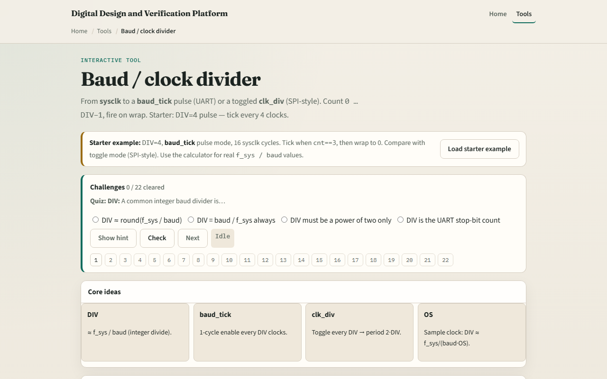

# Baud divider

Your system clock runs much faster than the UART bit rate

---

## Starter DIV equals four
- Starter preset: DIV equals four in baud_tick pulse mode, sixteen sysclk cycles shown
- Count zero, one, two, three, then baud_tick equals one on the wrap at cnt equals three
- In sixteen cycles you see four ticks
- Step once to watch cnt advance, or play to end for the full pattern
- Compare with toggle mode

---

## Browser lab

---

## Real RTL/TB practice
- In Track A, restate the divider formula in one sentence
- Draw a counter from zero to DIV minus one and mark where baud_tick goes high for one cycle
- Contrast that with a toggling clk_div output
- Optional: peek at UART RTL examples in this module’s examples and name where a
- This lab is divider literacy, not a full UART yet

---

## Pitfalls to watch
- Do not confuse baud_tick with the serial line, it is an internal enable, one sysclk wide
- Toggle mode is not UART bit timing; its period is two times DIV, not DIV
- Integer division truncates, real designs pick f_sys and baud so the error stays acceptable
- With oversampling
- And remember

---

## Your turn
- Complete the checklist for at least one track, preferably both
- In the browser, load starter DIV four pulse, step to a baud_tick at cnt three
- On paper, draw the counter wrap and one tick pulse
- When you are ready, take the short quiz, then continue to oversampling

