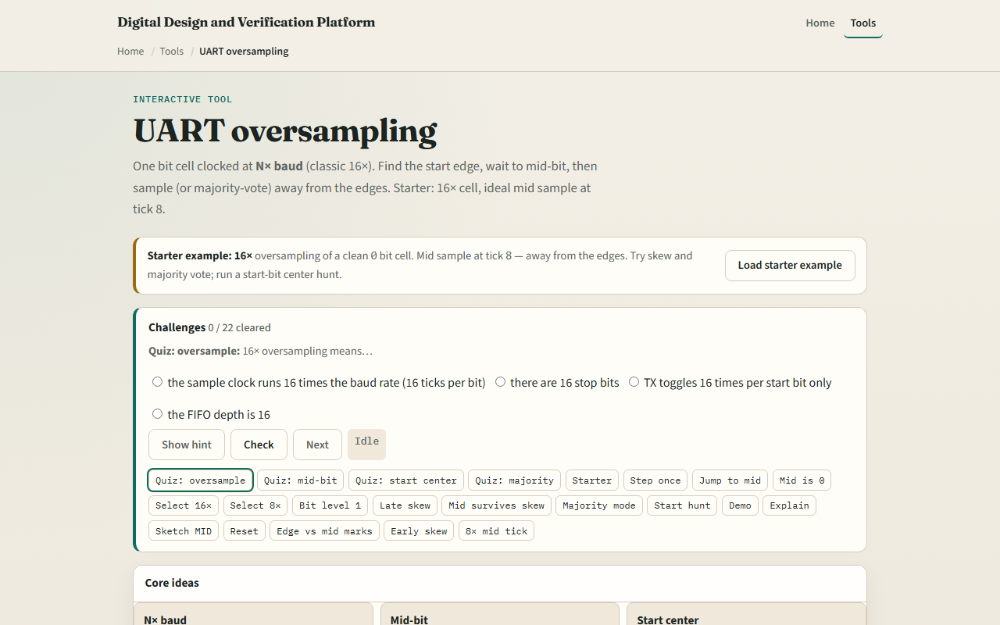

# Module 04 — Oversampling

**Module id:** module04-uart-oversample  
**Lab:** uart-oversample  
**Tracks:** A (real RTL/TB) · B (browser lab)

## Slide 1 — Oversampling

UART RX cannot rely on one sample per bit—the line transitions are noisy and slow. Oversampling runs a faster sample clock: eight or sixteen ticks per bit cell. The baud divider from the last module now divides by baud times OS. Each bit spans many sample clocks. You sample near the center of the cell, not at the edges where rise time and jitter live. That mid-bit point is where you decide whether the bit is zero or one.

## Slide 2 — Starter sixteen times

Starter preset: sixteen times oversampling of a clean zero bit cell, ideal skew zero. Sixteen sample ticks numbered zero through fifteen. Mid sample is tick eight—half of sixteen, away from both edges. Step tick to watch the cursor move, or jump to mid in one click. The verdict should show mid sample equals zero and decide equals zero. Try eight times oversample and mid moves to tick four. Switch decide to majority mid plus or minus one for a three-sample vote around the center.

## Slide 3 — Browser lab

In the browser lab, load the starter example and read the three idea cards—N times baud, mid-bit, and start center. The wave table marks mid with M and edges with e. Try edge skew late plus three—the early ticks look wrong but mid still reads zero on a clean cell. Run Start-bit hunt: after a falling edge, step until start centered fires at tick eight. Demo sixteen times mid and Explain summarize why we avoid the edges.

## Slide 4 — Real RTL/TB practice

In Track A, restate oversampling in one sentence—how many sample clocks fit in one bit at sixteen times. Draw tick zero through fifteen for a zero bit and circle the mid sample. Write what Start-bit hunt does after idle goes to zero. Optional: peek at UART RX examples in the legacy combined materials and name where a sample strobe would fire. This lab is sampling literacy—not a full synchronizer or metastability treatment yet.

## Slide 5 — Pitfalls to watch

Do not sample on the first tick after an edge—that is where skew and rise time hurt most. Mid equals OS divided by two; at eight times that is tick four, not eight. Majority vote helps a noisy mid but does not fix a completely wrong baud divider. Start-bit hunt centers on the start bit, not the first data bit—you still advance one full bit time per data sample after that. And remember: this animator uses ideal digital samples; real RX still needs sync, glitch filters, and error flags in the next module.

## Slide 6 — Your turn

Complete the checklist for at least one track—preferably both. In the browser, load starter sixteen times, jump to mid at tick eight, and run Start-bit hunt until start centered. On paper, draw sixteen ticks and mark the mid sample for a zero bit. When you are ready, take the short quiz, then continue to UART errors.
