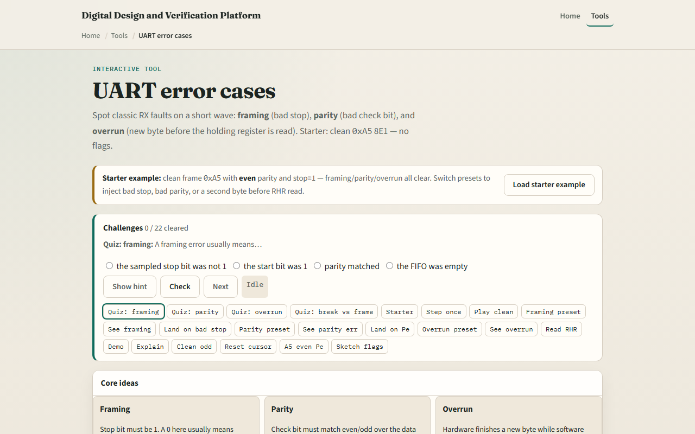

# UART error flags

A real UART RX does not just deliver bytes, it reports when something went wrong

---

## Starter clean A5 eight-E-one
- Starter preset
- All three flags start at zero
- Byte A5 has four ones in its eight bits, so the expected even parity bit Pe is zero
- Step bit through idle, start, D0 through D7, Pe, stop, and trailing idle
- Play to end and the verdict should read RX OK with flags clear
- The RHR panel shows the latched byte unread until you click Read RHR

---

## Browser lab

---

## Real RTL/TB practice
- In Track A, name the three UART RX status flags and what each one means in one line
- For hex A5 eight-E-one, compute the expected even parity bit
- Sketch what software should do when framing is set versus parity only
- Optional: peek at UART status-register examples in this module’s examples
- This lab is error literacy, your TB should still inject and check these flags explicitly

---

## Pitfalls to watch
- Framing and parity are sampled at the end of the frame
- A parity error can still latch data into RHR; framing often means the byte is suspect
- Overrun is a software-timing problem
- A line held low longer than a frame looks like repeated framing errors or break
- And remember

---

## Your turn
- Complete the checklist for at least one track, preferably both
- In the browser
- On paper, list framing, parity, and overrun and one cause for each
- When you are ready, take the short quiz, then continue to FIFO in the datapath

