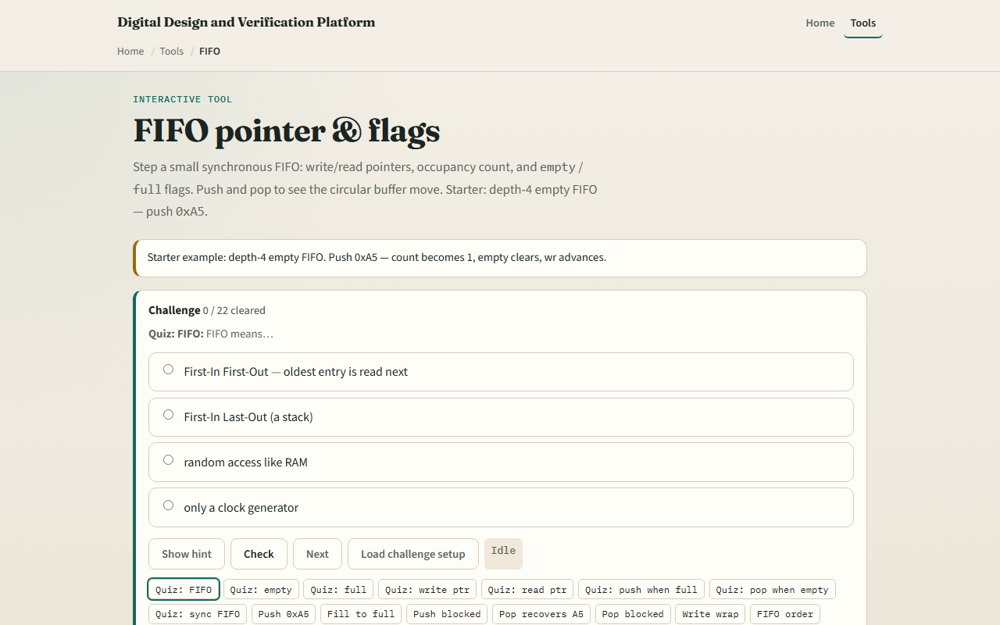

# FIFO in the datapath

UART bytes arrive asynchronously from the line rate while software reads when it can

---

## Starter depth four
- Starter preset: depth-four FIFO, empty, write and read pointers both at zero, count zero
- Din is hex A5
- Click Push once
- Slot zero holds A5
- Pop once and you get A5 back
- Fill with four pushes to see full equal one and a fifth push blocked in the event log

---

## Browser lab

---

## Real RTL/TB practice
- In Track A, restate FIFO in one sentence and why UART RX often needs one
- Draw four slots with wr and rd pointers after one push of A5
- Write the empty and full conditions using count and depth
- Optional: peek at FIFO examples in the legacy combined materials and name where full would
- This lab is pointer literacy

---

## Pitfalls to watch
- Do not pop when empty or push when full in real hardware without checking flags
- Write and read pointers wrap modulo depth
- A FIFO fixes overrun only if software or DMA keeps draining, it is not infinite buffering
- Almost-full at count depth minus one is a common interrupt threshold
- And remember

---

## Your turn
- Complete the checklist for at least one track, preferably both
- In the browser
- On paper, sketch wr and rd after two pushes and one pop
- When you are ready, take the short quiz, then continue to handshake

