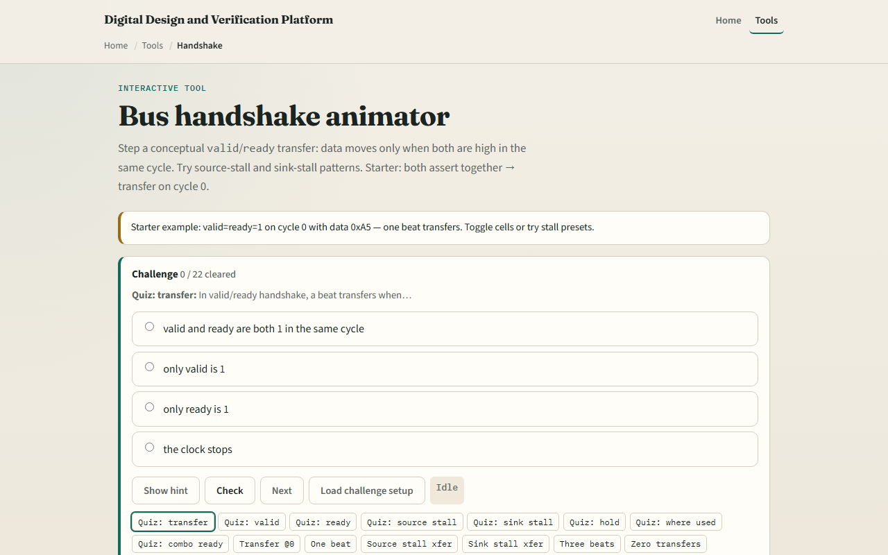

# Module 07 — Handshake

**Module id:** module07-handshake  
**Lab:** handshake  
**Tracks:** A (real RTL/TB) · B (browser lab)

## Slide 1 — Valid and ready

On-chip streaming interfaces move one beat per cycle when source and sink agree. Valid means the source offers data this cycle—the payload is meaningful. Ready means the sink can accept a beat. A transfer fires when both are one in the same cycle: fire equals valid and ready. Data is accepted only on fire. If ready is one but valid is zero, nothing moves—the source is not offering. If valid is one but ready is zero, the sink backpressures and a well-behaved source holds valid and data stable until the handshake completes.

## Slide 2 — Starter both assert

Starter preset: Both assert—valid and ready both high on cycle zero, data hex A5. Fire is one at cycle zero and exactly one beat transfers in the eight-cycle window. Step through cycles and watch the verdict panel—TRANSFER with the accepted byte, or no transfer. The fire row in the wave table marks every cycle where valid and ready overlap. Toggle valid or ready cells to see fire disappear. This is the same beat handshake you would use between a UART byte source and a FIFO sink—not RS-232 wire timing.

## Slide 3 — Browser lab

In the browser lab, load the starter example and read the rule box—fire equals valid and ready, data accepted only on fire. Try the stall presets: Source stall raises valid late so the first transfer lands on cycle two. Sink stall holds valid while ready is late—backpressure until cycle two. Back-to-back beats fires three transfers in a row. No transfer keeps valid and ready misaligned so fire never goes high. The transfer log lists each accepted byte by cycle.

## Slide 4 — Real RTL/TB practice

In Track A, write the fire equation and explain valid and ready in one sentence each. Sketch three cycles where valid is held high but ready is zero, then ready rises—when does the beat transfer? Optional: peek at streaming or AXI-Stream examples in the legacy materials and name the handshake signals. This lab is interface literacy—not a full protocol VIP or UART line driver.

## Slide 5 — Pitfalls to watch

Do not treat valid alone as a transfer—both must be one. Do not assume the source drops valid every cycle; it may hold through a sink stall. Avoid combinatorial loops where ready depends on valid and valid depends on ready in the same cycle—real designs separate those paths. Back-to-back bursts need ready high on consecutive cycles, not just one pulse. And remember: UART bytes on the wire use start and stop bits; this lab is the on-chip valid-ready slice after the shifter or before the FIFO.

## Slide 6 — Your turn

Complete the checklist for at least one track—preferably both. In the browser, load starter both assert, confirm one transfer of A5 at cycle zero, then try source stall and sink stall once each. On paper, draw valid and ready for two cycles that fire and one that does not. When you are ready, take the short quiz, then continue to self-check TB.
