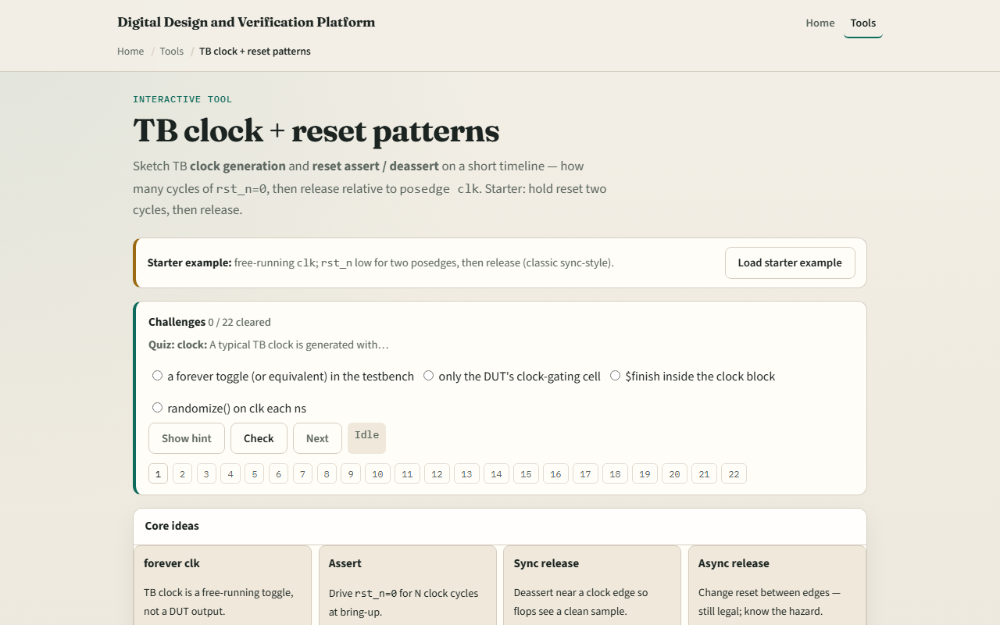

# Module 09 — TB clock / reset

**Module id:** module09-tb-clock-reset  
**Lab:** tb-clock-reset  
**Tracks:** A (real RTL/TB) · B (browser lab)

## Slide 1 — TB clock and reset

Every RTL testbench needs a clock and a reset before stimulus runs. The TB clock is a free-running forever toggle—it is not a DUT output. Active-low reset means assert by driving rst_n to zero for a chosen number of posedge cycles, then deassert back to one. Sync-style release aligns deassert with the clock so flops sample cleanly. Async release changes rst_n between edges—legal in real designs, but you should know the hazard. This lab reads half-cycle waves and a TB sketch side by side.

## Slide 2 — Starter classic assert times two

Starter preset: classic assert times two, sync release. Free-running clk toggles every half-cycle. rst_n stays low through two posedges—at half-cycles one and three—then rises at half-cycle four while clk is high after the second edge. Cursor starts at h4, the release point. Click Analyze and the flags show assert_posedges equals two, released equals one, release equals sync. The TB sketch shows repeat two at posedge clk, then rst_n equals one. That is the bring-up pattern you will reuse before UART byte checks.

## Slide 3 — Browser lab

In the browser lab, load the starter example and read the four idea cards—forever clk, assert, sync release, async release. The timeline marks posedges with an arrow on clk rows. Try async mid release—rst_n rises at h2 between edges. Hold forever keeps rst_n at zero with the clock still toggling. Idle preset has rst_n all ones with no assert phase. Long times four shows repeat four in the sketch. Demo async and Explain summarize sync versus mid-cycle release.

## Slide 4 — Real RTL/TB practice

In Track A, write a minimal initial block: clk toggle forever, rst_n assert for two posedges, then deassert. State why sync deassert is preferred for flops clocked on posedge clk. Optional: peek at a UART TB in this module’s examples and name where reset ends before the first byte drive. This lab is literacy—not a full simulator or metastability proof.

## Slide 5 — Pitfalls to watch

Do not confuse TB clock generation with the UART baud divider—they serve different roles. Assert means rst_n equals zero, not one. Counting reset cycles means posedges while rst_n is low, not arbitrary half-cycles. Releasing reset mid-cycle can work but is not the same as sync release at the edge. Hold forever means the DUT never leaves reset—useful to see the wave, not a passing test. And remember: real chips may need async assert with sync deassert; this lab shows the teaching patterns only.

## Slide 6 — Your turn

Complete the checklist for at least one track—preferably both. In the browser, load starter classic, Analyze for two assert posedges and sync release, then try async mid once. On paper, sketch clk and rst_n for two cycles in reset and one cycle out. When you are ready, take the short quiz, then continue to waves.
