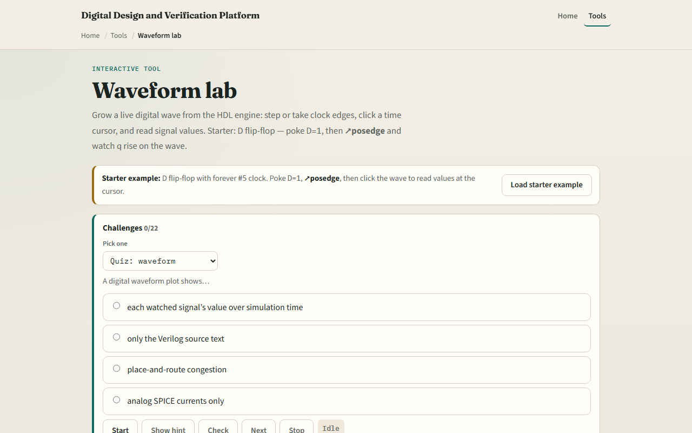

# Reading waves

Waveforms plot each watched signal’s value over simulation time

---

## Starter D flip-flop
- Starter preset
- Watch clk, d, and q
- Poke D equals one, then click posedge clk
- Q rises on the wave at the clock edge
- Before the edge you can poke D equals one while q still reads zero
- Click inside the wave panel to move the cursor and confirm q at the cursor time

---

## Browser lab

---

## Real RTL/TB practice
- In Track A, sketch clk, d, and q for one posedge where D was one before the edge
- Write why q updates at the edge, not when d changes alone
- After a UART sim, open a VCD in your viewer and name three signals you would watch first
- This lab teaches wave literacy

---

## Pitfalls to watch
- Do not treat eyeballing the wave as the pass criterion
- Do not assume q follows d instantly, posedge sampling and NBA timing matter
- A flat q with enable off is correct, not a broken sim
- Bus labels are binary or hex, read width before comparing
- And remember

---

## Your turn
- Complete the checklist for at least one track, preferably both
- In the browser, load D-FF starter, poke D equals one, posedge clk until q equals one
- On paper, draw one clk period and mark where q would update
- When you are ready, take the short quiz, then continue to TB versus UVM map

