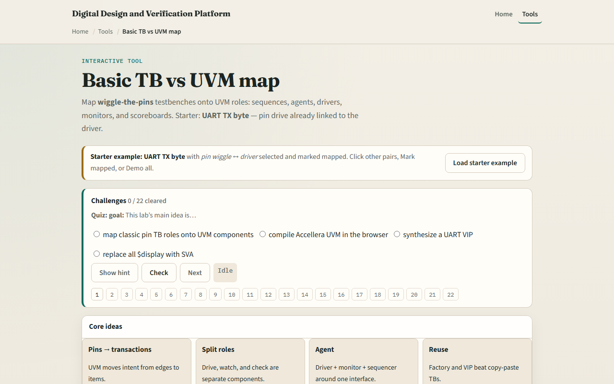

# Module 11 — TB vs UVM map

**Module id:** module11-tb-vs-uvm-map  
**Lab:** tb-vs-uvm-map  
**Tracks:** A (real RTL/TB) · B (browser lab)

## Slide 1 — From pin wiggle to agents

You already built a self-checking UART testbench with clock, reset, and inline expects. UVM does not replace that skill—it reorganizes it. Classic TBs wiggle pins in one module: tasks drive wires, initial blocks print values, and if checks fail you see an error right there. UVM splits those jobs into components: a driver touches pins through a virtual interface, a monitor watches passively, sequences feed stimulus, and a scoreboard compares transactions. This module is a literacy map, not a UVM compiler. The goal is to name each classic role and point to its UVM counterpart before you ever open a VIP package.

## Slide 2 — Six pairs on the map

The lab lines up six classic pieces with six UVM roles. Pin wiggle maps to driver plus virtual interface—procedural writes become reusable drive code behind a vif. Hard-coded vector lists map to sequences and a sequencer—scenario intent moves up from raw edges. A display peek maps to a monitor and analysis ports—observation splits from stimulus. Inline expect maps to a scoreboard—checks happen on transactions, not only wires. A flat module testbench maps to an environment and agents—hierarchy becomes test, env, agent, DUT. Copy-paste TB maps to factory overrides and VIP reuse—you swap agents, not whole files. Starter loads UART TX byte with pin-drive already selected and marked mapped—your first bridge says baud delays on tx become a uart driver on the vif.

## Slide 3 — Browser lab

In the browser lab, load the starter example and look at the two columns—classic on the left, UVM on the right. Click any pair to see the bridge text and UART vignette below. Mark mapped when you understand a pair; Map all when you want the full six. Switch the protocol vignette to SPI or I²C and Apply—the same six roles, different bus words. Demo all walks every pair; Explain prints the one-paragraph summary in the trace. Challenges quiz you on driver, sequence, and monitor mappings, then ask you to select check, observe, structure, and reuse. This is concept literacy—it does not synthesize a VIP or run Accellera UVM in the browser.

## Slide 4 — Real RTL/TB practice

In Track A, restate the core idea in one sentence: pins become transactions, and flat TB roles become agents. On paper, map these five classic pieces to UVM: pin wiggle, vector list, display peek, inline expect, and flat module tb. Optional: peek at an offline TB or UVM sketch in the linked in-course hello and label driver, monitor, and scoreboard in a UART byte send. You do not need a simulator for this beat—the mapping is the skill. When you later read a real uart_agent, you should recognize which old TB habit each component replaced.

## Slide 5 — Pitfalls to watch

Do not treat this lab as a substitute for running self-checking RTL—that was modules eight through ten. Do not assume UVM removes pin knowledge—the driver still creates the same edges, just behind a vif. A scoreboard is not only display—it compares predicted versus observed transactions. Sequences are not magic—they replace the vector lists you would have pasted into tasks. And remember: literacy first. Factory, objections, and RAL come later; here you only need to read a block diagram and know which classic habit moved where.

## Slide 6 — Your turn

Complete the checklist for at least one track—preferably both. In the browser, load starter, click through all six pairs, mark each mapped, and clear one quiz question on the driver role. On paper, draw test to env to agent to DUT for UART TX. When you are ready, take the short quiz, then continue to VIP anatomy.
