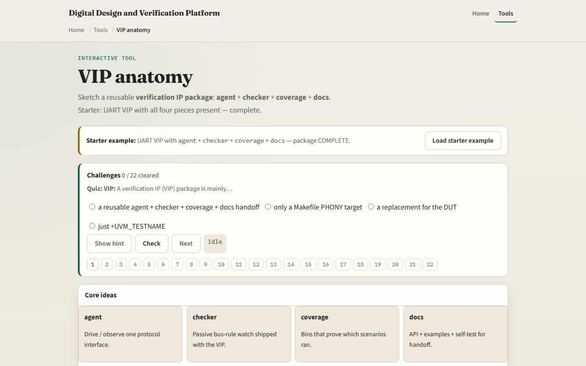

# Module 12 — VIP anatomy

**Module id:** module12-vip-anatomy  
**Lab:** vip-anatomy  
**Tracks:** A (real RTL/TB) · B (browser lab)

## Slide 1 — What a VIP package is

Module eleven mapped classic testbench habits onto UVM roles. A verification IP package is the reusable unit you hand to another team: not just an agent, but agent plus checker plus coverage plus docs. The agent drives and observes one protocol interface—sequencer, driver, monitor, and virtual interface around one bus. A checker watches bus rules passively—handshake legality, not payload scoreboard compares. Coverage proves which scenarios ran through covergroups and bins. Docs close the loop—API notes, README, examples, and a self-test path so consumers can integrate without guessing. Agent alone is a scaffold. Complete means all four pieces assembled and ready for handoff.

## Slide 2 — Starter and incomplete presets

Starter loads a complete UART VIP: agent, checker, coverage, and docs all included—the verdict reads COMPLETE and the package tree shows every folder checked. Scenario presets show what breaks handoff. Missing checker keeps agent, coverage, and docs but drops protocol rules—INCOMPLETE. Missing coverage drops bins while stimulus and checks remain—INCOMPLETE. Missing docs drops the self-test handoff even when code pieces exist—INCOMPLETE. Agent only is useful scaffolding, not a VIP yet. Empty package waits for you to toggle pieces in and click Assemble. Click a piece card once to select it; click again on the selected card to toggle it in or out of the package.

## Slide 3 — Browser lab

In the browser lab, load the starter example and read the handoff checklist—four OK rows and a COMPLETE verdict. Explore the package tree: agent folder for sequencer, driver, monitor, and interface; checker for protocol rules; coverage for bins; docs for API and self-test. Load missing checker and watch the verdict flip to INCOMPLETE with checker in the missing list. Demo incomplete jumps to that preset in one click. From empty, toggle all four pieces in and Assemble to rebuild COMPLETE. Challenges quiz you on agent, checker, and docs roles, then ask you to assemble complete and incomplete packages. This is literacy—not a commercial UART VIP you drop into synthesis.

## Slide 4 — Real RTL/TB practice

In Track A, restate the four VIP deliverables in one sentence each: agent, checker, coverage, docs. Sketch a UART VIP package tree and mark what is missing if you only ship an agent—checker, coverage, and docs should stay blank. Optional: peek at the linked UART RTL or TB sketch and label which folders would hold driver versus monitor versus protocol checker. Remember: scoreboard payload compare often lives in the environment; the VIP typically ships checker and coverage with the agent. Your job is to read a block diagram and know what a consumer still has to wire in the env.

## Slide 5 — Pitfalls to watch

Do not call an agent folder a finished VIP—handoff needs checker, coverage, and docs too. Do not confuse checker with scoreboard—the checker flags protocol legality; the scoreboard compares predicted versus observed data. Coverage is not optional decoration—it proves which bins your VIP scenarios actually hit. Docs are not README fluff—they include a self-test so integration does not stall. And remember: this lab teaches package anatomy. Factory overrides, RAL, and full UVM env wiring come in later courses—not here.

## Slide 6 — Your turn

Complete the checklist for at least one track—preferably both. In the browser, load starter, then Demo incomplete and name the missing piece. On paper, draw uart_vip with four subfolders and mark which are empty for agent-only. When you are ready, take the short quiz, then continue to UART complete—the course wrap module.
