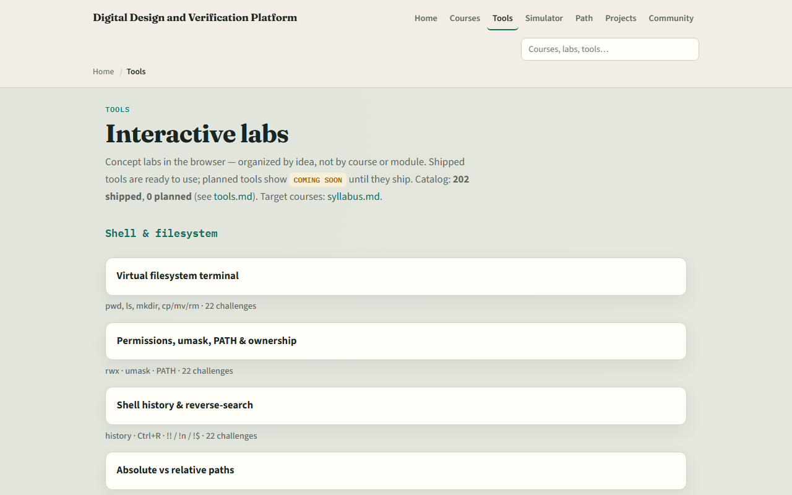

# UART complete

VIP package anatomy

---

## What you can do now
- You can describe a UART frame, idle, start, data, optional parity, stop
- You can map a UART spec into an RTL checklist and explain baud timing with oversampling
- You can place FIFO plus valid-ready handshake in a datapath story and sketch a
- You can read basic waves for debug and explain how classic pin TB roles map to agents
- That is UART literacy

---

## Close the track gaps
- If you mainly used browser labs
- Revisit any module you skipped on Track A with a short Verilog or paper sketch
- If you mainly used Track A
- Either track works for self-study; both together stick best before SPI, I²C, or UVM depth

---

## The tools you practiced
- Here is the tools index again
- You do not need to re-clear every challenge
- Use it as a map

---

## Next
- Complete the quiz for this part
- Continue to learn SPI or learn I²C when you want the next serial protocol with different

---

## Your turn
- Review the wrap checklist in the module README
- Confirm you completed Track A and/or Track B for the modules you care about
- When you are ready, take the short quiz, then open the next course that matches your path

